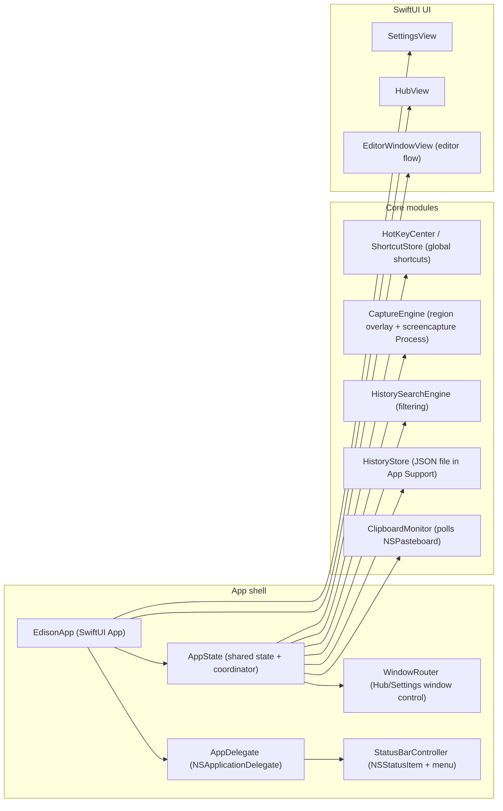

# Edison Repository Hardening Report

## Executive Summary

The entity["company","GitHub","code hosting platform"] repository implements a native macOS menu bar utility that combines clipboard history, screenshot capture, and a lightweight editor, with an explicit “local-first / private by default / no backend” product direction. citeturn13view0turn14view0turn12view1turn38view0

From a “bulletproof + professional” perspective, the biggest risks cluster around (a) App Sandbox correctness and App Store readiness, (b) long-term persistence scalability (especially images), and (c) silent failure paths for permissions and capture flows. citeturn14view5turn34view3turn41view2turn30view4turn24view1turn33view0

The highest-priority fixes that materially reduce crash risk and review risk are:

- **Fix a retain-cycle leak in screenshot capture**: `CaptureEngine.runScreencapture` captures the `Process` instance from inside its own `terminationHandler`, which is a classic strong reference cycle that can leak per capture. This is both correctness and “runs forever” reliability. citeturn30view4turn30view3  
- **Correct the macOS deployment target**: the Xcode project sets `MACOSX_DEPLOYMENT_TARGET = 26.3`, which is almost certainly unintended and would severely restrict compatibility (and may not be acceptable in distribution settings). citeturn41view7  
- **Make persistence scalable**: the current model stores full image binaries (and thumbnails) inline inside a JSON-backed history file (`ClipboardImageData` holds `Data` and `thumbnailData`). That can balloon storage, slow startup/load/save, and become a data corruption risk under heavy use. citeturn33view0turn24view1  
- **Make sandboxed file handling correct**: `ClipboardPayload.fileURL(URL)` is persisted as a raw URL, but a sandboxed app typically needs security-scoped bookmarks to regain access across launches; the app already advertises sandboxing enabled. citeturn33view0turn41view2turn42search7turn42search11  
- **Turn permission flows from “silent fallback” into guided UX**: App Review notes call out Screen Recording + optional Accessibility permissions; the code currently checks `AXIsProcessTrusted()` and silently falls back. Using `AXIsProcessTrustedWithOptions` (with prompting) plus clear “how to enable” UI reduces reviewer friction and support load. citeturn34view3turn23view1turn42search1turn42search9

## Repository Snapshot and Architecture

The repository contains both an Xcode project (`Edison.xcodeproj`) and a Swift Package layout, plus focused product/architecture/release docs. citeturn38view0turn39view0turn12view1turn14view5

The documented architecture direction is: **menu bar shell** (Hub + Settings) with **shared app state** coordinating clipboard, capture, search, and persistence; SwiftUI for most UI, AppKit for menu bar + hotkeys + macOS-specific behaviors; persistence is “simple file/UserDefaults, non-blocking”. citeturn12view1

### High-level component map



This diagram follows the repo’s stated structure and the concrete code wiring (`EdisonApp` → `AppDelegate`/`AppState`; status bar menu posts shortcut actions; `AppState` listens and orchestrates). citeturn12view1turn37view0turn37view2turn37view4turn32view6turn30view4turn24view5

## Issue Matrix and Fix Roadmap

Severity legend: **Critical** = likely crash/data loss/release blocker; **High** = major reliability/security/privacy issue; **Medium** = noticeable correctness/UX/perf risk; **Low** = polish / maintainability.

| Area | Issue | Evidence | Severity | Effort | Recommended fix |
|---|---|---|---|---|---|
| Runtime reliability | `Process` termination handler retains `process` (retain-cycle leak per capture). | `Edison/Core/Capture/CaptureEngine.swift` (`terminationHandler` references outer `process`). citeturn30view4turn30view3 | Critical | Low | Use the handler parameter (`{ process in ... }`) and avoid capturing the outer `process`; also capture `self` weakly. |
| App Store / compatibility | `MACOSX_DEPLOYMENT_TARGET = 26.3` is set in the Xcode project. | `Edison.xcodeproj/project.pbxproj`. citeturn41view7 | Critical | Low | Set a realistic min target (e.g., 13.0+ depending on feature set), and align CI/build docs accordingly. |
| Persistence scalability | Images stored inline in JSON history (`ClipboardImageData.data`, `thumbnailData`) → file growth + slow IO + higher corruption risk. | `Edison/Core/Models/ClipboardItem.swift`, `Edison/Core/Persistence/HistoryStore.swift`. citeturn33view0turn24view1 | High | High | Store images/thumbnails as files in Application Support; keep only metadata + relative paths in JSON. Add cleanup/retention. |
| Sandbox correctness | Persisting raw `fileURL(URL)` without security-scoped bookmarks breaks access across launches in App Sandbox. | `ClipboardPayload.fileURL(URL)`; sandbox enabled; Apple security-scoped access APIs. citeturn33view0turn41view2turn42search7turn42search11 | High | High | Replace persisted URL with security-scoped bookmark data; resolve on demand and call `startAccessingSecurityScopedResource()`. |
| Screenshot UX | Capture failures are silent: if `screencapture` fails (permissions, sandbox, user cancel), flow just returns. | `CaptureEngine.runScreencapture` guards on `terminationStatus == 0` else returns. citeturn30view4turn30view3 | High | Medium | Post a failure notification with reason; `AppState` should present a user-facing error + “how to enable Screen Recording” instructions. |
| Permissions UX | Accessibility “paste back” checks `AXIsProcessTrusted()` and silently falls back; doesn’t offer a prompt or guidance. | `AppState.pasteItem` guard; App Review notes mention Accessibility prompt; Apple supports prompting check. citeturn23view1turn34view3turn42search1turn42search9 | Medium | Medium | Use `AXIsProcessTrustedWithOptions` with prompt; add a Settings help CTA. |
| Shortcuts reliability | Ignores `RegisterEventHotKey` status; no conflict detection or user feedback for failed registration. | `HotKeyCenter.apply` calls `RegisterEventHotKey` but doesn’t check return codes. citeturn26view0turn26view4 | Medium | Low | Check OSStatus; if registration fails, surface it in Settings and/or revert to safe defaults. |
| UI reliability | Key recorder’s local event monitor may not be removed if the NSView is deallocated while recording. | Key recorder installs local monitor; removal relies on resign-first-responder path. citeturn29view0turn29view3 | Medium | Medium | Add `deinit { removeMonitor() }`; harden focus-loss handling (window close, tab switch). |
| Performance | Clipboard polling every 0.6s can create needless wakeups/CPU, especially on laptops; improve timer behavior and backoff. | `ClipboardMonitor` uses a repeating `Timer` and checks `pasteboard.changeCount`. citeturn24view7turn43search2 | Medium | Medium | Use `DispatchSourceTimer` on a utility queue; pause when hub closed and no capture active; dynamic interval/backoff. |
| Data integrity | Persistence write errors are swallowed (`try? data.write(...)`) → silent data loss. | `HistoryStore.save` writes with `try?`; errors ignored; decoder fallback/quarantine exists only for reads. citeturn24view1turn24view2 | Medium | Low | Return/log errors; add OSLog and optionally a user-facing “storage error” banner. |
| CI robustness | CI only runs SwiftPM build/test; does not validate Xcode scheme, sandbox settings, signing-related warnings, or App Store packaging. | `.github/workflows/ci.yml` and local CI script are “swift build + swift test”. citeturn9view0turn10view0 | Medium | Medium | Add `xcodebuild test` (and optionally `xcodebuild archive`) on CI; pin runner image. |
| Compliance / docs | Missing repo-level governance files (LICENSE, SECURITY policy, CONTRIBUTING, CODEOWNERS) reduces professionalism and operational clarity. | Root file listing shows no such files. citeturn38view0 | Low | Low | Add standard OSS meta files + release checklist. |

## Code Quality and Runtime Reliability Hardening

### Fix the screenshot capture retain-cycle and improve failure signaling

Current code in `CaptureEngine` creates a `Process`, assigns a `terminationHandler`, and inside that handler references the outer `process` variable. Because the handler is retained by `Process`, and the handler retains `process`, this forms a strong reference cycle. citeturn30view4turn30view3

A minimal, safe patch:

```diff
diff --git a/Edison/Core/Capture/CaptureEngine.swift b/Edison/Core/Capture/CaptureEngine.swift
index 0000000..0000000 100644
--- a/Edison/Core/Capture/CaptureEngine.swift
+++ b/Edison/Core/Capture/CaptureEngine.swift
@@
-  let process = Process()
+  let process = Process()
   process.executableURL = URL(fileURLWithPath: "/usr/sbin/screencapture")
   process.arguments = arguments + [outputURL.path]
-  process.terminationHandler = { _ in
+  process.terminationHandler = { [weak self] process in
     DispatchQueue.main.async {
       defer { try? FileManager.default.removeItem(at: outputURL) }
       guard
         process.terminationStatus == 0,
         let imageData = try? Data(contentsOf: outputURL)
       else {
-        return
+        // TODO: post a failure notification so AppState can present guidance.
+        return
       }
-      self.postCaptureNotification(imageData: imageData)
+      self?.postCaptureNotification(imageData: imageData)
     }
   }
```

This change eliminates the cycle and makes it straightforward to add structured error signaling for non-zero termination or missing output. citeturn30view4turn30view3

### Ensure region-selection overlay can’t get “stuck”

`RegionSelectionSession` installs a local event monitor and removes it on `finish(with:)`, which is good, but it relies on receiving mouse-up or Escape while the app remains active. citeturn31view0turn31view2

Two hardening measures are typical for “bulletproof” capture UX:

- Cancel capture if the app resigns active (user Cmd-Tabs away) or if the overlay windows are closed unexpectedly.
- Add a timeout fail-safe (e.g., 30–60s) that auto-cancels.

The code already centralizes teardown in `finish(with:)`, so adding a notification observer for `NSApplication.didResignActiveNotification` (and removing it in `finish`) is a low-risk way to prevent a stuck overlay state. citeturn31view2turn30view2

### Improve hotkey registration correctness and user feedback

`HotKeyCenter.apply(shortcuts:)` registers keys via Carbon’s `RegisterEventHotKey` but never checks return status; it also records bindings even if registration fails. citeturn26view0turn26view4

A minimal correctness fix is to check OSStatus and only record successful registrations; then surface failures back to Settings (e.g., show “This shortcut conflicts with another app”):

```diff
diff --git a/Edison/Core/Shortcuts/HotKeyCenter.swift b/Edison/Core/Shortcuts/HotKeyCenter.swift
@@
-  RegisterEventHotKey(
+  let status = RegisterEventHotKey(
     shortcut.keyCode,
     shortcut.modifiers,
     hotKeyID,
     GetApplicationEventTarget(),
     0,
     &hotKeyRef
   )
-  hotKeyRefs.append(hotKeyRef)
-  bindings[hotKeyID.id] = action
+  guard status == noErr, hotKeyRef != nil else {
+    // TODO: propagate failure to UI (Settings) so user can choose another shortcut.
+    continue
+  }
+  hotKeyRefs.append(hotKeyRef)
+  bindings[hotKeyID.id] = action
```

This aligns with the app’s App Store review narrative that shortcuts should “work out of the box,” and it reduces “mysterious shortcut not working” support cases. citeturn34view2turn26view0

### Replace silent persistence errors with logged/handled errors

`HistoryStore.save` uses `try? data.write(...)` and drops errors; `ShortcutStore` drops encoding errors similarly. citeturn24view1turn28view0

At minimum, add structured logging (see Observability below) and return a `Result<Void, Error>` for callers to decide whether to show UI.

The repo’s own architecture direction explicitly calls out “Keep read/write safe and non-blocking.” Turning silent failures into visible errors is the difference between “safe” and “quietly losing data.” citeturn12view1turn24view1

## Security and Privacy

### App Sandbox and file access model must match product behavior

The Xcode project enables App Sandbox (`ENABLE_APP_SANDBOX = YES`) and user-selected file access is set to `readonly`. citeturn41view2turn41view5  
Apple’s sandbox model requires explicit declaration/intent for restricted resources, and file access is mediated by user selection and security-scoped URLs/bookmarks. citeturn42search6turn42search10

Two concrete mismatches to address:

- **Writing exports under sandbox**: exporting uses `NSSavePanel` then writes `payload.data.write(to: url, options: .atomic)`. citeturn33view3turn33view4  
  If the entitlement is truly read-only, writing could fail depending on the exact entitlements produced; this should be validated under a sandboxed, signed build (the App Store scenario). citeturn41view2turn42search10

- **Persisting file references**: the app stores `.fileURL(URL)` in history and later uses `Data(contentsOf: url)` when exporting/sharing. citeturn33view0turn33view4  
  Under sandbox, durable access across launches generally requires security-scoped bookmarks and calling `startAccessingSecurityScopedResource()` on the resolved URL. citeturn42search7turn42search11

### Permission prompting should be explicit and reviewer-friendly

The App Store review packet anticipates:

- Screen Recording permission may be prompted on first screenshot use. citeturn34view3  
- Accessibility permission is required only for the optional “paste back into previous app” flow; otherwise user pastes manually. citeturn34view3turn23view1  

For Accessibility, Apple provides `AXIsProcessTrustedWithOptions(_:)` to check trust and (optionally) prompt the user. citeturn42search1  
For Screen Recording / screen capture, Apple provides preflight/request APIs in CoreGraphics and ScreenCaptureKit’s stream APIs (and the framework overview stresses high-performance capture for Mac apps). citeturn42search4turn42search0turn43search1turn43search0

A “professional” pattern:

- When the user invokes **Capture Area/Window/Full Screen**, preflight permission, and if missing, show an in-app blocking sheet: “Enable Screen Recording in System Settings → Privacy & Security → Screen Recording.”  
- When user invokes **Paste Back**, if not trusted, show a one-time banner with an “Enable Accessibility” CTA that triggers the system prompt via `AXIsProcessTrustedWithOptions`. citeturn42search1turn34view3turn23view1

### Data-at-rest risk framing and user controls

The constraints say “Private by default” and “Local-first storage.” citeturn14view0turn12view1  
Given the app stores clipboard contents and screenshots, a professional baseline is to provide:

- Clear retention controls (e.g., max items, max disk usage, auto-expire after N days).
- A one-click “Clear All History” and “Pause Clipboard Monitoring.”
- An explicit privacy statement in README / in-app “About”.

The repo already documents no external services and no accounts. Converting that into user-facing privacy/retention controls reduces perceived risk and improves reviewer confidence. citeturn34view2turn13view0turn14view0

## Build, CI/CD, and Testing Strategy

### CI gaps and recommended pipelines

Current CI runs on `macos-latest` and performs SwiftPM build/test; the local CI script mirrors this. citeturn9view0turn10view0  
This is a good start, but it does **not** validate the actual Xcode scheme and App Store-relevant settings (sandbox, hardened runtime, generated Info.plist, etc.). The Xcode project clearly targets a sandboxed `.app` (`productType = com.apple.product-type.application`, sandbox enabled, hardened runtime enabled). citeturn41view2turn41view3

A “bulletproof” CI layout typically includes:

- **SwiftPM lane**: `swift build`, `swift test` (fast, catches many regressions). citeturn9view0  
- **Xcode lane**: `xcodebuild test` against the app scheme (catches entitlements, resources, asset catalog, generated Info.plist settings, and scheme wiring). citeturn41view2turn41view5  
- **Static checks lane**: formatting + linting + basic security scanning (see below).

### Exact commands to run locally

Run existing checks:

```bash
# SwiftPM
swift build
swift test

# Repo-provided macOS CI mirror
./scripts/ci-local-macos.sh
```

These are consistent with the repository’s documented workflow and scripts. citeturn38view0turn10view0

Add Xcode scheme tests (recommended):

```bash
# List schemes first, then run tests (example scheme name inferred from PRODUCT_NAME)
xcodebuild -list -project Edison.xcodeproj

# Run unit tests (add/adjust scheme name as needed)
xcodebuild test \
  -project Edison.xcodeproj \
  -scheme "Edison - Clipboard Manager" \
  -destination "platform=macOS" \
  -configuration Debug
```

The scheme/product naming and app target are present in the Xcode project settings (`PRODUCT_NAME = "Edison - Clipboard Manager"`). citeturn41view4

### Testing strategy focused on the highest-risk modules

The repo has a SwiftPM test target (`Edison/Tests`). citeturn38view0turn20view20  
Given current risk profile, tests should prioritize:

- `HistoryStore`: round-trip encode/decode; corrupt file quarantine; concurrent save/load; large history behavior. citeturn24view1turn24view2  
- `HistorySearchEngine`: type filters and query normalization behavior. citeturn25view2  
- `ImageProcessing`: rejects invalid data; bounds output sizes; avoids crashing on weird image inputs. citeturn33view2  
- Permission-gated flows: `pasteItem` fallback when Accessibility not granted; structured error presentation for export/share. citeturn23view1turn33view3turn33view4  

For flakiness avoidance: isolate time (`Timer`-driven clipboard polling) behind injected clocks/schedulers; don’t unit test polling loops directly—unit test the “process snapshot” function with a stubbed pasteboard. citeturn24view7turn43search2

## Observability, Performance, and Configuration Management

### Add structured logging with OSLog/Logger

Right now, failure paths in persistence and capture often “return” with no durable trace. citeturn24view1turn30view3  
Apple’s `Logger` API is designed for structured messages that can be filtered by subsystem/category. citeturn43search3turn43search7turn43search24

Recommended pattern:

- Define `Logger` instances per domain: `clipboard`, `capture`, `persistence`, `shortcuts`, `ui`.
- Log at `.error` when:
  - `HistoryStore.save` fails to write.
  - Capture process exits non-zero.
  - Hotkey registration fails (non-`noErr` status). citeturn24view1turn30view3turn26view0turn43search3

### Performance hotspots to address early

- **History file size growth (images)**: embedding image blobs in JSON is the single biggest scalability risk today. citeturn33view0turn24view1  
  Moving images to filesystem storage with a manifest-style JSON makes load/save bounded and enables partial cleanup.

- **Clipboard polling**: polling every 0.6s is a reasonable MVP tradeoff, but for “professional” battery/CPU behavior, adapt the polling interval and pause when monitoring is disabled or app is idle. `NSPasteboard.changeCount` is explicitly intended as a change detector. citeturn24view7turn43search2  

### Centralize configuration keys and defaults

There are already multiple `UserDefaults` keys in different modules (e.g., shortcuts key, shelf height key). citeturn28view0turn37view5  
A small `AppConfig` or `DefaultsKeys` struct avoids drift and makes “reset to defaults” easy to implement.

## Documentation, Release Engineering, and Developer Experience

### App Store readiness items already documented—align code to them

The current task doc explicitly targets “Edison 1.1 release and App Store review” and calls out finalizing release metadata, removing placeholders, and making capture accessible from menu bar. citeturn14view5turn37view2turn37view4  
The App Store release packet also outlines exactly what reviewers should do and what permissions are expected. citeturn34view2turn34view3

To make the repo “professional,” ensure:

- The menu bar capture items exist and work (they do exist: “Capture Area/Window/Full Screen” hooks in `StatusBarController`/`AppDelegate`). citeturn37view2turn37view4  
- Permission prompts are guided and non-silent (see Security/Privacy section). citeturn34view3turn42search1turn42search4  

### Fix the deployment target and release metadata correctness

The Xcode project sets:

- `PRODUCT_BUNDLE_IDENTIFIER = com.chenkahana.Edison`
- `MARKETING_VERSION = 1.0`
- `CURRENT_PROJECT_VERSION = 2`
- `GENERATE_INFOPLIST_FILE = YES`
- `MACOSX_DEPLOYMENT_TARGET = 26.3` citeturn41view4turn41view5turn41view6turn41view7  

For App Store distribution, versioning and deployment target should be deliberate and consistent with feature requirements. A deployment target that doesn’t match real macOS versions is a release blocker. citeturn41view7

### Add standard repository “professionalism” files

The root does not show common governance files (LICENSE, SECURITY.md, CONTRIBUTING.md, CODEOWNERS). citeturn38view0  
Adding them reduces friction for collaborators and establishes security disclosure norms.

## Patch Snippets for the Most Impactful Fixes

### Correct the macOS deployment target in the Xcode project

A minimal change (exact value depends on your support policy; choose based on features you rely on):

```diff
diff --git a/Edison.xcodeproj/project.pbxproj b/Edison.xcodeproj/project.pbxproj
@@
-  MACOSX_DEPLOYMENT_TARGET = 26.3;
+  MACOSX_DEPLOYMENT_TARGET = 14.0;
```

This addresses the explicit project setting in `project.pbxproj`. citeturn41view7

### Add Accessibility prompt flow for “paste back”

Current behavior: if not trusted, `pasteItem` returns after copying to clipboard (manual paste fallback). citeturn23view1turn34view3  
Recommended: on first use, prompt with `AXIsProcessTrustedWithOptions`. citeturn42search1turn42search9

Illustrative snippet (shape only):

```swift
// In AppState, before attempting CGEvent posting:
let options = [kAXTrustedCheckOptionPrompt.takeUnretainedValue() as String: true] as CFDictionary
let trusted = AXIsProcessTrustedWithOptions(options)
guard trusted else {
  // show banner explaining manual paste fallback
  return
}
```

This leverages the Apple-supported prompting API. citeturn42search1

### Introduce OSLog logging for storage and capture

Use `Logger` (Swift) as recommended by Apple’s OSLog docs. citeturn43search3turn43search24

Example structure:

```swift
import OSLog

enum Log {
  static let capture = Logger(subsystem: Bundle.main.bundleIdentifier ?? "Edison", category: "capture")
  static let store = Logger(subsystem: Bundle.main.bundleIdentifier ?? "Edison", category: "store")
}
```

Then, replace silent `try?` paths with logged failures in `HistoryStore` and capture code. citeturn24view1turn30view3turn43search3