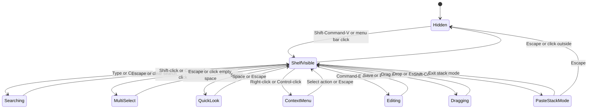

# UI Style Guide

## Purpose
This document captures the UI changes Edison should make so the clipboard experience feels very close to Paste while reading as even more native to modern macOS. It is adapted from the external deep-research report and rewritten into repo-friendly implementation guidance.

## Product intent
Edison should feel like:
- A native macOS utility first
- A keyboard-first clipboard shelf second
- A polished glass interface without looking gimmicky

The goal is not to invent a brand-new interaction model. The goal is to adopt the best parts of the Paste mental model and implement them with stronger macOS materials, accessibility behavior, and engineering guardrails.

## Experience goals
- Present history as a floating shelf with a horizontal visual timeline
- Keep the primary workflow fast enough for hotkey-driven reuse
- Use glass and translucency as a system effect, not as a custom blur trick
- Reserve warm brand tinting for accents, not for large background fills
- Preserve readability and usability when transparency, motion, or contrast settings change

## Layout model

### Primary surface
The main clipboard UI should be a wide floating shelf that opens near the bottom of the screen and displays recent items in a horizontally scrollable timeline.

Recommended structure:
1. Header bar with search, scope controls, and pinboard or collection navigation
2. Primary item rail with large preview cards
3. Optional preview or detail pane for expanded inspection
4. Contextual actions surfaced through menus, keyboard shortcuts, and direct item interaction

### Item cards
Cards should feel roomy, highly legible, and quick to scan. They should surface:
- content preview
- content type
- relative time
- source app when available
- selection state
- quick action affordances only when necessary

Recommended default sizes:
- Shelf height, compact: `156`
- Shelf height, regular: `240`
- Search pill height: `36`
- Text or link card: `200 x 180`
- Image card: `180 x 180`

## Visual system

### Design principles
- Prefer system materials over custom blur math
- Use large radii and subtle layering to create depth
- Keep the overall palette restrained and professional
- Put color emphasis into item-type accents, focus states, and micro-highlights
- Let wallpaper and system appearance do part of the visual work

### Color tokens

#### Accent palette
- `accent.brand`: `#FF9400`
- `accent.brandAlt`: `#FFB250`
- `surface.black`: `#101010`

#### Light appearance
- `text.primary`: `rgba(0, 0, 0, 0.90)`
- `text.secondary`: `rgba(0, 0, 0, 0.60)`
- `text.tertiary`: `rgba(0, 0, 0, 0.38)`
- `glass.base`: `rgba(255, 255, 255, 0.52)`
- `glass.tintWarm`: `rgba(255, 180, 90, 0.10)`
- `glass.stroke`: `rgba(255, 255, 255, 0.26)`
- `divider.onGlass`: `rgba(0, 0, 0, 0.10)`
- `shadow.key`: `rgba(0, 0, 0, 0.18)`
- `shadow.ambient`: `rgba(0, 0, 0, 0.08)`
- `selection.fill`: `rgba(0, 122, 255, 0.18)`

#### Dark appearance
- `text.primary`: `rgba(255, 255, 255, 0.92)`
- `text.secondary`: `rgba(255, 255, 255, 0.70)`
- `text.tertiary`: `rgba(255, 255, 255, 0.45)`
- `glass.base`: `rgba(30, 30, 30, 0.58)`
- `glass.tintWarm`: `rgba(255, 148, 0, 0.10)`
- `glass.stroke`: `rgba(255, 255, 255, 0.14)`
- `divider.onGlass`: `rgba(255, 255, 255, 0.10)`
- `shadow.key`: `rgba(0, 0, 0, 0.55)`
- `shadow.ambient`: `rgba(0, 0, 0, 0.30)`
- `selection.fill`: `rgba(10, 132, 255, 0.28)`

#### Content-type accents
- `type.link`: `#0A84FF`
- `type.text`: `#34C759`
- `type.image`: `#FF3B30`
- `type.file`: `#8E8E93`

Use these colors as header strips, badges, or icon accents. Avoid saturating entire cards with them.

### Material strategy
Use `NSVisualEffectView` for the primary glass surfaces.

Recommended mapping:
- `material.glassPrimary` -> `.hudWindow`
- `material.glassSecondary` -> `.popover`
- `material.glassSidebar` -> `.sidebar`

Recommended blending:
- Shelf root: `.behindWindow`
- Nested cards: avoid nested blur; use semi-opaque fills over the root material

### Glass layering recipe
Each major glass surface should use this stack:
1. Backdrop material via `NSVisualEffectView`
2. Warm tint wash at low opacity
3. Specular highlight overlay
4. Optional subtle noise to reduce banding

Suggested top highlight:
- Light mode: `linear-gradient(180deg, rgba(255,255,255,0.22), rgba(255,255,255,0.00))`
- Dark mode: `linear-gradient(180deg, rgba(255,255,255,0.10), rgba(255,255,255,0.00))`

### Radii
| Token | Value |
| --- | ---: |
| `radius.window` | `28` |
| `radius.card` | `18` |
| `radius.menu` | `12` |
| `radius.pill` | `999` |

The overall feel should be intentionally round and shelf-like, not just mildly rounded.

### Shadows
Use restrained, two-layer shadows:

- `shadow.ambient`: `0 2 10 0 rgba(0,0,0,0.08)`
- `shadow.key`: `0 10 28 -6 rgba(0,0,0,0.18)`

For nested cards, reduce the shadow intensity by about forty percent so they feel seated on the shelf rather than floating independently.

### Spacing
Use an 8-point base grid with 4-point sub-steps.

| Token | Value |
| --- | ---: |
| `space.1` | `4` |
| `space.2` | `8` |
| `space.3` | `12` |
| `space.4` | `16` |
| `space.5` | `20` |
| `space.6` | `24` |

### Typography
Use system typography so Edison stays aligned with macOS.

- UI font: SF Pro via system APIs
- Monospace: SF Mono or the system monospaced font
- Symbols: SF Symbols only unless a concept cannot be represented well

Recommended type roles:

| Role | Size | Weight | Line height |
| --- | ---: | --- | ---: |
| `title.shelf` | `13` | `Semibold` | `16` |
| `body.card` | `12` | `Regular` | `16` |
| `meta.card` | `10` | `Regular` | `13` |
| `kbd.hint` | `10` | `Medium` | `13` |
| `search.text` | `13` | `Regular` | `16` |

### Iconography
- Use SF Symbols for search, pin, trash, share, quick look, edit, rename, and source-app hints where appropriate
- Prefer hierarchical rendering for toolbar icons
- Keep toolbar icons in the `14-16 pt` range
- Keep card badges around `12 pt`

## Interaction model

### Core shortcuts
Edison should preserve the keyboard-first expectations users already have from similar tools.

| Action | Shortcut |
| --- | --- |
| Toggle shelf | `Shift-Command-V` |
| Search | `Command-F` or type-to-search |
| Quick Look | `Space` |
| Edit | `Command-E` |
| Rename | `Command-R` |
| New item | `Command-N` |
| Paste Stack mode | `Shift-Command-C` |

### Selection and navigation
- Arrow keys navigate between items
- Trackpad and mouse scroll the timeline
- Return pastes the selected item
- Double-click pastes the selected item
- Command-click and Shift-click enable multi-select
- Multi-select paste should preserve selection order semantics

### Quick paste
Quick paste number badges should be visible on eligible cards when the feature is active. Holding Command and pressing the displayed number should paste that item immediately.

### Preview and edit flow
- `Space` opens Quick Look style preview
- Preview should support links, images, text, and files
- `Command-E` enters edit mode from the current selection or preview
- `Command-R` should rename the item when supported
- Editing should feel lightweight and local, not like navigating to a new screen

### Direct paste
When Edison can paste directly into the active app, it should do so. When Accessibility permission is missing, fall back to copying the item and clearly explain the fallback in calm, native language.

### Drag and drop
Dragging items into another app should remain a first-class flow.

During drag:
- Scale the dragged card to about `1.02`
- Increase shadow depth slightly
- Use a compact drag preview with content preview and multi-item badge when needed

### Context menus
Use context menus as the main overflow action surface.

Recommended grouping:
- Primary: Paste, Paste as Plain Text, Copy
- Secondary: Edit, Rename, Pin, Delete
- Tertiary: Quick Look, Share

Show keyboard equivalents whenever possible.

### UI state map


## Accessibility

### Transparency and contrast
- Respect Reduce Transparency and replace glass with opaque surfaces
- Use opaque fallbacks such as `#F2F2F7` in light mode and `#1C1C1E` in dark mode
- Aim for at least `4.5:1` contrast for primary text in worst-case wallpaper conditions
- Do not rely on color alone for item state, grouping, or selection

### Larger text
- Use scalable text styles instead of fixed metrics for core text
- Let cards grow vertically before over-truncating content
- Preserve shelf usability up to large accessibility text sizes

### VoiceOver and keyboard
Each card should expose:
- label: content type plus title or summary
- value: copied time plus source app
- actions: Paste, Copy, Quick Look, Pin, Delete

Recommended focus order:
1. Search field
2. Pinboard or collection controls
3. Item list from left to right
4. Preview pane

## Implementation notes

### Architecture
Use a hybrid approach:
- AppKit for windowing, window level, materials, and panel behavior
- SwiftUI for card layouts, content previews, and view composition where productive

### Window setup
- Use a borderless `NSPanel` for the shelf
- Make the panel feel lightweight and fast to show or dismiss
- Put a single `NSVisualEffectView` at the root
- Avoid large numbers of nested visual effect views

### Animation
Use short, intentional motion.

| Token | Value |
| --- | --- |
| `anim.fast` | `0.12s` |
| `anim.standard` | `0.20s` |
| `anim.emphasis` | `0.28s` |
| `curve.standard` | `easeInOut` |
| `curve.spring` | `spring(response: 0.32, dampingFraction: 0.82, blendDuration: 0)` |

Recommended use:
- Hover and focus transitions use `anim.fast`
- Open and close transitions use `anim.standard`
- Preview expansion and drag lift use `anim.emphasis`

### Performance guardrails
- Keep the blurred region bounded to the visible shelf
- Avoid continuously animating blur or material changes
- Animate opacity, transform, and overlay layers instead
- Treat Reduce Transparency testing as a required regression pass

## Developer handoff checklist
- Add design tokens in Swift as a single source of truth
- Centralize colors, radii, spacing, shadow, and motion tokens
- Define reusable components for shelf, search pill, item card, preview, and confirmation surfaces
- Define accessibility labels and actions per component
- Add a keyboard-navigation matrix for all major flows
- Verify direct paste permissions and fallback copy behavior

## Example token payload
```json
{
  "meta": {
    "name": "EdisonGlass",
    "version": "1.0"
  },
  "color": {
    "accentBrand": "#FF9400",
    "text": {
      "primaryLight": "rgba(0,0,0,0.90)",
      "secondaryLight": "rgba(0,0,0,0.60)",
      "primaryDark": "rgba(255,255,255,0.92)",
      "secondaryDark": "rgba(255,255,255,0.70)"
    },
    "glass": {
      "baseLight": "rgba(255,255,255,0.52)",
      "baseDark": "rgba(30,30,30,0.58)",
      "strokeLight": "rgba(255,255,255,0.26)",
      "strokeDark": "rgba(255,255,255,0.14)",
      "tintWarmLight": "rgba(255,180,90,0.10)",
      "tintWarmDark": "rgba(255,148,0,0.10)"
    },
    "selection": {
      "fillLight": "rgba(0,122,255,0.18)",
      "fillDark": "rgba(10,132,255,0.28)"
    }
  },
  "radius": {
    "window": 28,
    "card": 18,
    "menu": 12,
    "pill": 999
  },
  "space": {
    "1": 4,
    "2": 8,
    "3": 12,
    "4": 16,
    "5": 20,
    "6": 24
  },
  "motion": {
    "fast": 0.12,
    "standard": 0.20,
    "emphasis": 0.28,
    "curve": {
      "standard": "easeInOut",
      "spring": {
        "response": 0.32,
        "dampingFraction": 0.82,
        "blendDuration": 0
      }
    }
  }
}
```

## Example macOS glass wrapper
```swift
import AppKit
import SwiftUI

struct VisualEffectView: NSViewRepresentable {
    var material: NSVisualEffectView.Material
    var blendingMode: NSVisualEffectView.BlendingMode
    var state: NSVisualEffectView.State

    func makeNSView(context: Context) -> NSVisualEffectView {
        let view = NSVisualEffectView()
        view.material = material
        view.blendingMode = blendingMode
        view.state = state
        return view
    }

    func updateNSView(_ nsView: NSVisualEffectView, context: Context) {
        nsView.material = material
        nsView.blendingMode = blendingMode
        nsView.state = state
    }
}

struct GlassBackground: View {
    @Environment(\.accessibilityReduceTransparency) private var reduceTransparency

    var body: some View {
        ZStack {
            if reduceTransparency {
                RoundedRectangle(cornerRadius: 28, style: .continuous)
                    .fill(Color(NSColor.windowBackgroundColor))
            } else {
                VisualEffectView(
                    material: .hudWindow,
                    blendingMode: .behindWindow,
                    state: .active
                )
                .clipShape(RoundedRectangle(cornerRadius: 28, style: .continuous))
                .overlay(
                    RoundedRectangle(cornerRadius: 28, style: .continuous)
                        .strokeBorder(Color.white.opacity(0.20), lineWidth: 1)
                )
                .overlay(
                    LinearGradient(
                        colors: [Color.white.opacity(0.18), Color.white.opacity(0.0)],
                        startPoint: .topLeading,
                        endPoint: .bottomTrailing
                    )
                    .clipShape(RoundedRectangle(cornerRadius: 28, style: .continuous))
                )
            }
        }
    }
}
```
